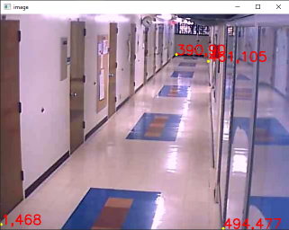

# Hallway_Corridor_Camera_Tracking
Задача: Необходимо реализовать трекер людей с отображением пройденного пути на кадре длиной N пикселей. 
За опорную точку взять нижнюю среднюю точку bounding box.

Дополнительно: сделать отображение пути сверху, bird-eye view. Использовать для этого матрицу гомографии.

Usage example:
```bash
python main.py --video_name video/004.avi --n_frames 10 --get_coord no
```
В этом [датасете](http://www.santhoshsunderrajan.com/datasets.html#hfh_tracking) были даны матрицы гомографии для видео,но они оказались не правильными, поэтому я получаю их с помощью cv2.findHomography. Для этого, выбираются ключевые точки пола на изображении, и с помощью функции get_homography_matrix() получается  необходимая матрица.

*Пример выбранных точек для 4-ого видео* 



Результат тестового задания продемонтрирован на видео, левая часть видео -- это трэкер людей с отображением пройденного пути на кадре длиной N пикселей,
а правая -- это отображение пройденного пути сверху(bird-eye view).

https://github.com/MaximKondakov/Test-tasks/assets/85742231/c1ad0bcb-60f8-41ca-a36a-8f24ce3707dc

